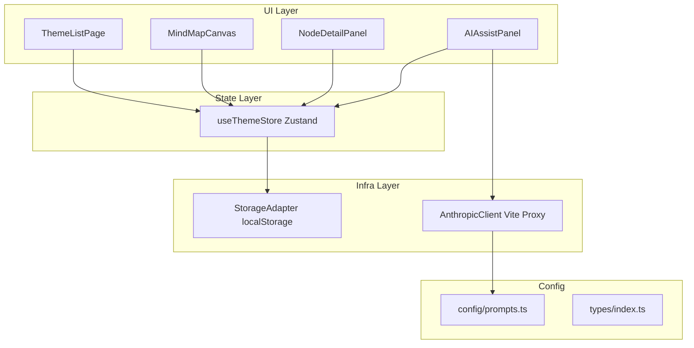
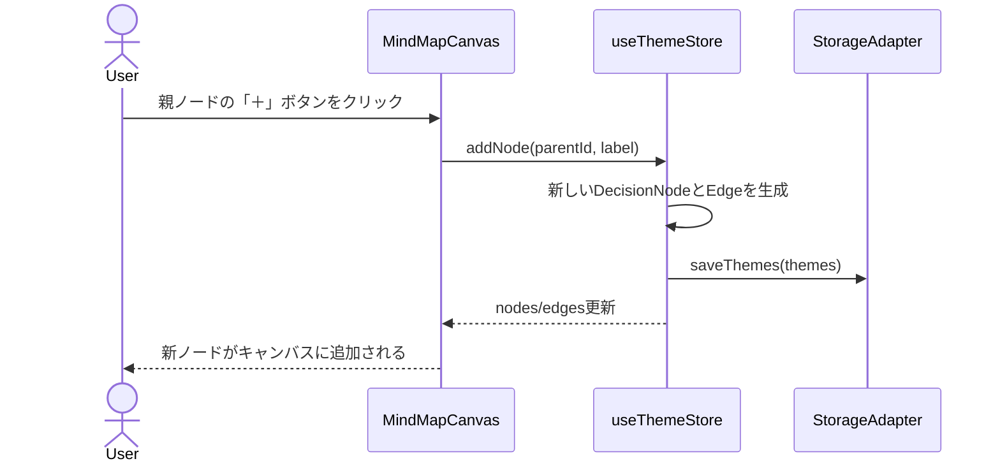
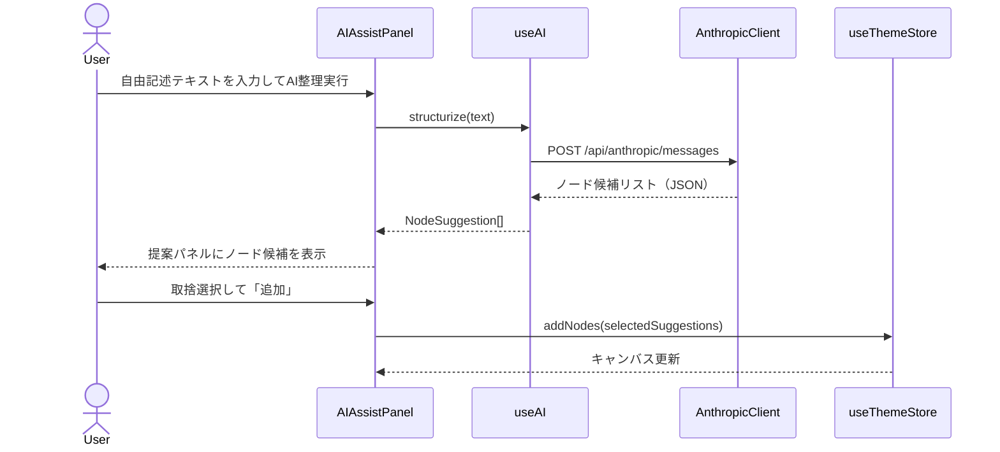

# Design Document — dx-thought-map

## Overview

DX思考マップは、DX推進チームがDX施策の検討過程・意思決定経緯をマインドマップ形式で記録・可視化するSPA（シングルページアプリケーション）である。テーマ単位でノードとエッジのツリーを構築し、各ノードに「判断理由」「却下理由」「ステータス」等のメタデータを付与することで、「なぜこの施策を選んだか」を後からたどれる。

**ユーザー**: DX推進チーム（生産技術部門、数名）がテーマの作成・編集・AI補助を日常的に利用する。**範囲（Phase 1）**: 個人PC上のプロトタイプ。チーム共有・認証・外部DBはPhase 3以降に対応。

### Goals

- テーマ作成からノード編集・AI補助までのコア体験を1週間で動くプロトタイプとして実現する
- localStorage永続化によりDB不要でオフライン動作を保証する
- データ層を`lib/storage.ts`に集約し、Phase 3のSupabase移管時の変更箇所を局所化する

### Non-Goals

- チーム共有・リアルタイム同期（Phase 3）
- 認証・アクセス制御（Phase 3）
- 外部DB・サーバーサイド（Phase 3）
- エクスポート（PDF/画像）、ファイル添付（将来）
- モバイル最適化（デスクトップブラウザのみ対応）

---

## Requirements Traceability

| Requirement | Summary | Components | Interfaces | Flows |
|---|---|---|---|---|
| 1.1–1.5 | テーマ管理 | ThemeListPage, useThemeStore, StorageAdapter | ThemeRepository | — |
| 2.1–2.6 | マインドマップキャンバス | MindMapCanvas, DecisionNode（カスタムノード）, useThemeStore | ReactFlow NodeTypes | ノード追加・削除フロー |
| 3.1–3.5 | ノードメタデータ管理 | NodeDetailPanel, useThemeStore | DecisionNodeData | — |
| 4.1–4.5 | AI思考整理補助 | AIAssistPanel, useAI, AnthropicClient | AIService | AI補助フロー |
| 5.1–5.4 | データ永続化 | StorageAdapter, useThemeStore | ThemeRepository | — |

---

## Architecture

### Architecture Pattern & Boundary Map



- **Selected pattern**: レイヤードアーキテクチャ（UI → State → Infra）
- **Domain boundaries**: UIコンポーネントはuseThemeStoreのみを介してデータを操作する。直接StorageAdapterを呼ばない
- **Steering compliance**: `types/`への型先行設計、`lib/`へのインフラ集約、`config/`へのプロンプト集約（tech.md / structure.md準拠）

### Technology Stack

| Layer | Choice / Version | Role | Notes |
|---|---|---|---|
| UI Framework | React 18 + TypeScript strict | コンポーネント・フック実装 | Vite 5でバンドル |
| 描画 | @xyflow/react v12 | マインドマップキャンバス | `useNodesState` / `useEdgesState` 利用 |
| State | Zustand v5 | グローバル状態管理・localStorage同期 | 約1KB gzip |
| Persistence | localStorage | テーマ/ノード/エッジの永続化 | `lib/storage.ts`に集約 |
| AI | Anthropic API（Claude claude-sonnet-4-6） | 思考整理補助・構造化提案 | Vite devProxy経由（CORS回避） |
| Build | Vite 5 | 開発サーバー・バンドル・proxy設定 | `server.proxy`でAnthropic APIをプロキシ |

---

## System Flows

### ノード追加フロー



### AI補助フロー



---

## Components and Interfaces

### Component Summary

| Component | Layer | Intent | Req Coverage | Key Dependencies | Contracts |
|---|---|---|---|---|---|
| ThemeListPage | UI | テーマ一覧・作成・削除 | 1.1–1.5 | useThemeStore (P0) | State |
| MindMapCanvas | UI | React Flowキャンバス描画 | 2.1–2.6 | useThemeStore (P0), @xyflow/react (P0) | State |
| DecisionNode | UI | カスタムノードコンポーネント | 2.2, 2.6, 3.1 | useThemeStore (P0) | State |
| NodeDetailPanel | UI | ノードメタデータ編集パネル | 3.1–3.5 | useThemeStore (P0) | State |
| AIAssistPanel | UI | AI補助テキスト入力・候補表示 | 4.1–4.3 | useAI (P0), useThemeStore (P1) | Service |
| useThemeStore | State | Zustandストア（テーマ/ノード/エッジ管理） | 1–5全域 | StorageAdapter (P0) | State, Service |
| useAI | Hook | AI API呼び出しとレスポンスパース | 4.1–4.5 | AnthropicClient (P0) | Service |
| StorageAdapter | Infra | localStorage CRUD操作 | 5.1–5.4 | — | Service |
| AnthropicClient | Infra | Anthropic API HTTP呼び出し | 4.1, 4.4, 4.5 | Vite proxy (P0) | API |

---

### UI Layer

#### ThemeListPage

| Field | Detail |
|---|---|
| Intent | テーマの一覧表示・新規作成・削除を担当するルートページ |
| Requirements | 1.1, 1.2, 1.3, 1.4, 1.5 |

**Responsibilities & Constraints**
- テーマカード一覧をuseThemeStoreから読み取り表示する
- 新規テーマ作成ダイアログの表示・確定処理を行う
- テーマ削除確認ダイアログを表示し、承認時にuseThemeStore.deleteThemeを呼ぶ
- ビジネスロジックをコンポーネントに書かず、全てuseThemeStoreのアクションに委譲する

**Contracts**: State [ ✓ ]

**Implementation Notes**
- ThemeCardはサマリーのみ（新規境界なし）。タイトル・更新日時表示のみ
- テーマID選択時に`/canvas/:themeId`へルーティング

---

#### MindMapCanvas

| Field | Detail |
|---|---|
| Intent | React Flowを用いたマインドマップキャンバス描画・インタラクション処理 |
| Requirements | 2.1, 2.2, 2.3, 2.4, 2.5, 2.6 |

**Dependencies**
- External: @xyflow/react v12 — ノード/エッジ描画・ドラッグ・ズーム（P0）
- Inbound: useThemeStore — nodes, edges, addNode, deleteNode（P0）
- Outbound: NodeDetailPanel — ノード選択時に表示切り替え（P1）
- Outbound: AIAssistPanel — AI補助パネルの表示切り替え（P1）

**Contracts**: State [ ✓ ]

##### State Management

- State model: React Flowの`useNodesState` / `useEdgesState`とZustandのuseThemeStoreを同期する。`onNodesChange`ハンドラでZustandに変更を伝播する
- Concurrency strategy: ローカルのみなので競合なし

**Implementation Notes**
- `nodeTypes`に`DecisionNode`カスタムコンポーネントを登録する
- ルートノード（`node.id === theme.id`）は削除ボタンを非表示にする
- `onNodeClick`でNodeDetailPanelを開く

---

#### NodeDetailPanel

| Field | Detail |
|---|---|
| Intent | 選択ノードのメタデータ（ラベル・理由・ステータス等）を編集するサイドパネル |
| Requirements | 3.1, 3.2, 3.3, 3.4, 3.5 |

**Contracts**: State [ ✓ ]

##### State Management

- State model: ローカルフォームstate（useState）で編集中の値を保持し、保存時にuseThemeStore.updateNodeを呼ぶ
- Validation: ラベル（必須）が空の場合は保存ボタンをdisabledにし、エラーメッセージを表示する

**Implementation Notes**
- ステータス選択はselectまたはradioボタン（選定済み・検討中・却下）
- 親コンポーネント（MindMapCanvas）からselectedNodeIdをpropsで受け取る

---

#### AIAssistPanel

| Field | Detail |
|---|---|
| Intent | 自由記述テキスト入力→AI構造化→ノード候補選択・追加UI |
| Requirements | 4.1, 4.2, 4.3 |

**Dependencies**
- Inbound: useAI — structurize(text): Promise\<NodeSuggestion[]\>（P0）
- Inbound: useThemeStore — addNodes（P1）

**Contracts**: Service [ ✓ ], State [ ✓ ]

**Implementation Notes**
- ローディング中はスピナーを表示し、入力UIを無効化する
- 提案パネルはチェックボックスリスト形式。全選択/全解除トグルを提供する
- AI呼び出し失敗時はエラーメッセージを表示するがパネルは閉じない（4.4対応）

---

### State Layer

#### useThemeStore

| Field | Detail |
|---|---|
| Intent | アプリ全域のテーマ・ノード・エッジ状態をZustandで管理し、localStorageと同期する |
| Requirements | 1.1–1.5, 2.2–2.5, 3.3–3.4, 5.1–5.4 |

**Responsibilities & Constraints**
- テーマ一覧（`themes: Theme[]`）と現在編集中テーマID（`currentThemeId: string | null`）を保持する
- 全ミューテーション後にStorageAdapterを通じてlocalStorageを更新する
- テーマ/ノード/エッジのCRUD操作をアクションとして公開する

**Dependencies**
- Outbound: StorageAdapter — saveThemes, loadThemes（P0）

**Contracts**: State [ ✓ ], Service [ ✓ ]

##### Service Interface

```typescript
interface ThemeStoreState {
  themes: Theme[]
  currentThemeId: string | null
  // Actions
  createTheme(title: string): void
  deleteTheme(themeId: string): void
  selectTheme(themeId: string): void
  addNode(parentId: string, label: string): void
  updateNode(nodeId: string, data: Partial<DecisionNodeData>): void
  deleteNode(nodeId: string): void
  updateNodePosition(nodeId: string, position: Position): void
  addNodes(suggestions: NodeSuggestion[]): void
}
```

- Preconditions: `addNode` — `parentId`が現在テーマのノードとして存在すること
- Postconditions: 全ミューテーション後にStorageAdapter.saveThemesが呼ばれること
- Invariants: ルートノード（`node.id === currentTheme.id`）は削除不可

---

### Infra Layer

#### StorageAdapter

| Field | Detail |
|---|---|
| Intent | localStorageのCRUD操作を抽象化し、将来のSupabase移管に備える |
| Requirements | 5.1, 5.2, 5.3, 5.4 |

**Contracts**: Service [ ✓ ]

##### Service Interface

```typescript
interface ThemeRepository {
  loadThemes(): Theme[]
  saveThemes(themes: Theme[]): void
  getStorageUsage(): { used: number; limit: number; ratio: number }
}

class LocalStorageAdapter implements ThemeRepository {
  private readonly KEY = 'dx-thought-map:themes'
  loadThemes(): Theme[]
  saveThemes(themes: Theme[]): void
  getStorageUsage(): { used: number; limit: number; ratio: number }
}
```

- Preconditions: `saveThemes` — themesはJSON.stringify可能なオブジェクトであること
- Postconditions: `loadThemes` — localStorage未初期化時は空配列を返すこと
- Invariants: `getStorageUsage().ratio >= 0.9`の場合、useThemeStoreが警告を発出する（Req 5.4）

---

#### AnthropicClient

| Field | Detail |
|---|---|
| Intent | Anthropic APIへのHTTPリクエストをVite devProxy経由で実行し、レスポンスをパースする |
| Requirements | 4.1, 4.4, 4.5 |

**Contracts**: API [ ✓ ]

##### API Contract

| Method | Endpoint | Request | Response | Errors |
|---|---|---|---|---|
| POST | /api/anthropic/messages | MessagesRequest | NodeSuggestion[] | 401, 429, 500 |

**Implementation Notes**
- APIキーは`import.meta.env.VITE_ANTHROPIC_API_KEY`から読み込む
- Vite `vite.config.ts`に`server.proxy: { '/api/anthropic': { target: 'https://api.anthropic.com', changeOrigin: true, rewrite: (path) => path.replace(/^\/api\/anthropic/, '') } }`を設定する
- レスポンスのパース失敗時は`Result<NodeSuggestion[], AIError>`型でエラーを返し、UIに伝播する

---

## Data Models

### Domain Model

**Aggregates**:
- `Theme` — ルート集約。テーマタイトル、ノード一覧、エッジ一覧を所有する
- `DecisionNode` — テーマ内のノードエンティティ。位置・メタデータ・ステータスを保持する

**Invariants**:
- 各テーマは必ず1つのルートノード（`id === theme.id`）を持つ
- エッジのsource/targetは同一テーマ内のノードIDのみ参照する

### Logical Data Model

```typescript
// types/index.ts

type NodeStatus = 'selected' | 'considering' | 'rejected'

interface Position {
  x: number
  y: number
}

interface DecisionNodeData {
  label: string
  reason?: string           // 判断理由
  rejectionReason?: string  // 却下理由
  relatedInfo?: string      // 関連情報
  status: NodeStatus
  isRoot: boolean
}

interface DecisionNode {
  id: string
  type: 'decisionNode'
  position: Position
  data: DecisionNodeData
}

interface FlowEdge {
  id: string
  source: string  // DecisionNode.id
  target: string  // DecisionNode.id
}

interface Theme {
  id: string
  title: string
  createdAt: string   // ISO 8601
  updatedAt: string   // ISO 8601
  nodes: DecisionNode[]
  edges: FlowEdge[]
}

interface NodeSuggestion {
  label: string
  reason?: string
  status: NodeStatus
}
```

**localStorage物理構造**:
- キー: `dx-thought-map:themes`
- バリュー: `JSON.stringify(Theme[])`

---

## Error Handling

### Error Strategy

- **UIエラー**: バリデーション失敗はフォームフィールド直下にインラインメッセージ表示
- **AI APIエラー**: トースト通知でエラー内容を表示し、ローカル操作は継続可能な状態を保つ
- **localStorage容量警告**: `StorageUsage.ratio >= 0.9`でバナー警告を表示する

### Error Categories

| Category | Trigger | Response |
|---|---|---|
| バリデーション | ラベル空で保存 | 保存ブロック + フィールドエラーメッセージ |
| AI API 401 | APIキー不正 | 「APIキーを確認してください」トースト |
| AI API 429 | レート制限 | 「しばらく待ってから再試行してください」トースト |
| AI API 500 | サーバーエラー | 「AI補助が一時的に利用できません」トースト |
| AI パース失敗 | 応答フォーマット不正 | 「AIの応答を解析できませんでした」トースト + 手動入力促す |
| Storage 容量 | 使用率90%超 | バナー警告「ストレージ容量が不足しています」 |

---

## Testing Strategy

### Unit Tests

- `StorageAdapter.loadThemes` — localStorage未初期化時に空配列を返すこと
- `StorageAdapter.saveThemes` — 保存後に`loadThemes`で同値が復元できること
- `useThemeStore.addNode` — 親ノードが存在しない場合にエラーになること
- `useThemeStore.deleteNode` — ルートノードが削除されないこと
- `AnthropicClient` — APIキー未設定時に適切なエラーが返ること

### Integration Tests

- テーマ作成 → ノード追加 → ページリロード後にデータが復元されること
- AI補助テキスト入力 → NodeSuggestion生成 → キャンバスへの追加が反映されること

---

## Security Considerations

- `VITE_ANTHROPIC_API_KEY`はビルド成果物（dist/）に含まれる。プロト段階は個人PCのみで使用し、社外秘情報は扱わない
- `.env`は`.gitignore`に追加必須
- Phase 3移管時にAPIキーをサーバーサイドへ移動し、クライアントから除去する

---

## Migration Strategy

Phase 3（会社PC移管時）のデータ層差し替え手順：

1. `LocalStorageAdapter`と同じ`ThemeRepository`インターフェースを実装した`SupabaseAdapter`を`lib/`に追加する
2. `useThemeStore`の初期化時に`LocalStorageAdapter`→`SupabaseAdapter`を差し替える
3. 既存localStorageデータは初回起動時に`SupabaseAdapter.saveThemes`でマイグレーションする
